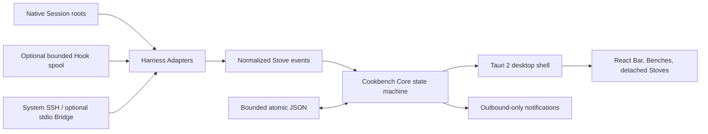
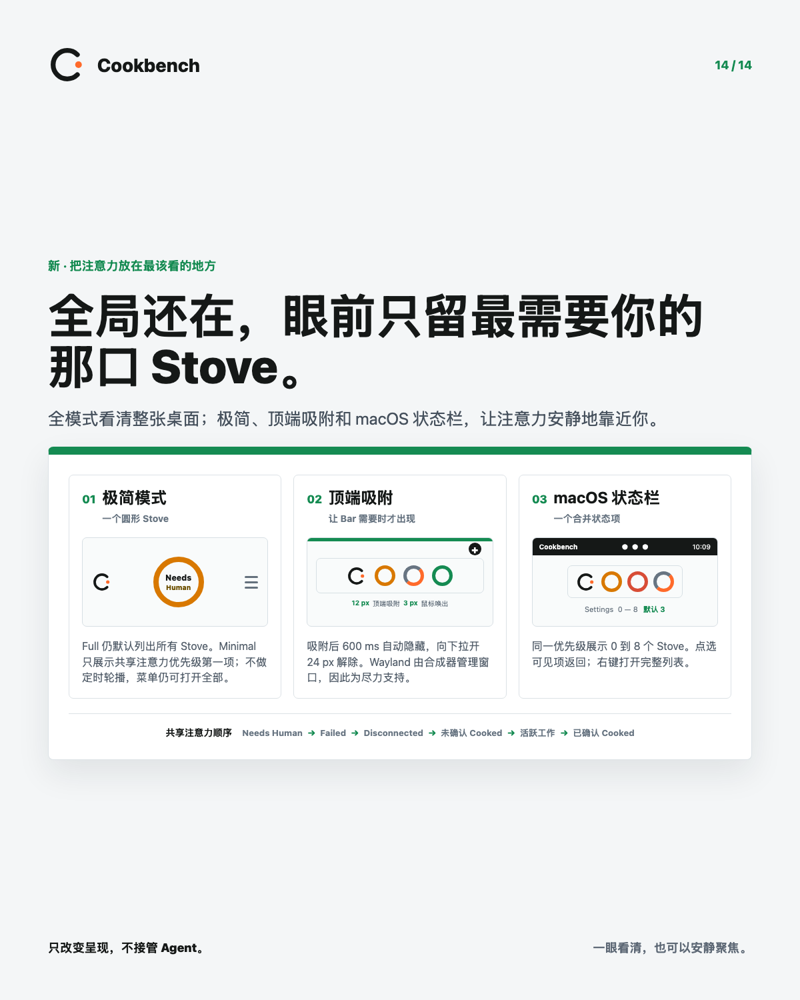

# Cookbench

<p align="center"></p>

<p align="center"><strong>コーディング Agent は働き続ける。Cookbench は、それを読める状態に保つ。</strong></p>

<p align="center">
  すでに使っている Agent Session のための、小さく local-first なデスクトップ workbench。<br>
  1 Session は 1 Stove。デスク全体には 1 Bar。トランスクリプト倉庫なし。Agent の control plane なし。
</p>

<p align="center">
  <a href="README.md">English</a> · <a href="README.zh-CN.md">简体中文</a> ·
  <a href="README.ja.md">日本語</a> · <a href="README.ko.md">한국어</a>
</p>

<p align="center">
  <a href="https://github.com/finitein/cookbench/actions/workflows/ci.yml"></a>
  <a href="https://github.com/finitein/cookbench/releases"></a>
  <a href="LICENSE"></a>
  
  
</p>


Cookbench は、「もう一つ Agent を起動した」と「入力待ちのターミナルはどれか？」の
あいだにある、足りなかった status surface です。Codex、Claude Code、Pi と、ほか 24
の coding-agent surface を観測し、安全なライフサイクル metadata を正規化して、各
Session をコンパクトな **Stove** として描画します。元のツールは引き続き仕事を所有し
ます。Cookbench の役割は、混雑した agentic desktop を読めるようにすることだけです。

- **観測し、命令しない。** Agent の起動、prompt の送信、tool の承認、遠隔 control は
  行いません。
- **ネイティブ file が事実源。** SQLite の transcript store も、会話履歴の複製も
  作りません。
- **小さく設計。** 記録済みの macOS arm64 build は disk 上で約 18 MiB、idle RSS は約
  90 MiB でした。これは host 固有の測定であり、普遍的な約束ではありません。
  [performance evidence](docs/verification/performance-macos.md) を確認してください。

## 並列 Agent のための、欠けていた Control Surface

多数の独立した coding run を扱う dashboard として、terminal tab は不十分です。title は
変わり、background work は見えなくなり、完了 task は idle task に見え、入力待ちの一つを
見つけることが手作業の探索になります。

Cookbench はこの desk に小さな visual grammar を与えます。

| 概念 | 意味 |
| --- | --- |
| **Session** | Codex、Claude Code、Pi、または別の Harness が所有する native task |
| **Stove** | 1 Session の identity、lifecycle state、activity、検証済み return target |
| **Bench** | Stove が密になったときだけ Harness ごとにまとめる responsive row |
| **Bar** | すべての表示 Stove を含む、移動・自由 resize 可能な global surface |

Bar は horizontal / vertical scrollbar の奥に work を隠す代わりに複数 row へ広がります。
通常の desktop window のように任意の場所へ移動・resize でき、独立して detach した Stove
とも共存します。hover detail は任意で、既定では off。役に立ちながら visual noise には
なりません。

### State は装飾ではなく evidence

| State | Cookbench が示すこと | Ring |
| --- | --- | --- |
| **Cooking** | structured evidence が Harness の作業中を示す | 信頼できる numeric progress があるときだけ partial。なければ animated indeterminate ring |
| **Needs Human** | Harness が明示的に attention を必要としている | complete ring |
| **Cooked** | authoritative な completion event を観測した | complete ring。clear するまで残る |
| **Failed** | structured failure event を観測した | complete ring |
| **Disconnected** | local または SSH source が利用不能になった | complete ring。Cooked へ黙って変換しない |

長期の Stove は pin して二日間の freshness limit から除外できます。Archive には期限切れ
または手動で外した Session が入り、Restore は誤操作から復帰させます。Cooked 以外の表示
Stove は、元の Harness Session を削除せずに外せます。

## Desk を絞り込み、全体は失わない

**Full** は既定のままです。すべての表示 Stove を並べ、密度が上がれば Bench へ広がります。
**Minimal** を選ぶと、共有 attention priority の一番上だけを一つの円形 Stove として表示
します。順序は Needs Human、Failed、Disconnected、未確認 Cooked、active work、確認済み
Cooked で、同順位は新しい state evidence を優先します。timed carousel はなく、priority
menu からほかの Stove にも到達できます。

global Bar を現在の monitor 上端へ drag すると dock します。上端から 12 px 以内で drop
すると dock し、600 ms 後に auto-hide、上端 3 px で再表示します。24 px 下へ引くと undock
します。detached Stove は従来どおり自由に動かせます。Wayland の dock は compositor の
制約により best effort です。

v0.4.1 safety hotfix では、mirrored dual display で再現した WindowServer crash を受け、dynamic
macOS status-bar Stove rendering を一時停止します。検証済みの static Cookbench tray と menu は
残ります。0 から 8 個（既定 3）の保存済み preference は将来の独立検証済み復帰に備えて保持し、
Minimal mode と top docking は影響を受けません。

## Orchestration ではなく Observability のために

| Cookbench がすること | Cookbench が意図的にしないこと |
| --- | --- |
| bounded な native identity と lifecycle state を観測 | Harness を host、置換、監督、control |
| native Session file を source of truth として維持 | prompt、response、command、transcript 全文を複製 |
| 検証済みの Session-to-window identity chain で return | 推測した terminal を exact match と主張 |
| optional な local / outbound-only notification を送信 | chat command の受信、inbox poll、remote Agent 操作 |
| system SSH で remote Session を inspect | SSH password の保存、listening port の公開 |
| preference、pin、archive、placement 用の bounded atomic JSON を保存 | SQLite の conversation warehouse を構築 |

これは「後で追加する機能」ではなく、意図した architecture boundary です。正確な契約は
[Privacy](docs/privacy.md)、[Security](docs/security.md)、[installation / SSH](docs/installing.md)
で読めます。

## 1 Command で Install

Cookbench v0.4.1 は unsigned preview です。first-party bootstrap は
`release-manifest.json` を download し、この machine 用の native package を選び、SHA-256
digest を検証してから install します。

macOS universal または graphical Ubuntu/Linux x86_64:

```bash
curl -fsSL https://github.com/finitein/cookbench/releases/download/v0.4.1/install.sh | COOKBENCH_VERSION=v0.4.1 COOKBENCH_ALLOW_PRERELEASE=1 bash
```

Windows x64 PowerShell:

```powershell
$env:COOKBENCH_VERSION='v0.4.1'; $env:COOKBENCH_ALLOW_PRERELEASE='1'; irm https://github.com/finitein/cookbench/releases/download/v0.4.1/install.ps1 | iex
```

macOS/Linux は `--dry-run`、全 platform では `COOKBENCH_DRY_RUN=1` を使うと install せずに
artifact 選択を確認できます。preview package は unsigned の場合があります。stable build、
source build、platform runtime、SSH、removal の詳細は
[Installing Cookbench](docs/installing.md) を見てください。Cookbench はまだ Homebrew、winget、
APT repository には publish していないため、動かない command を README に載せません。

## Start Cooking

1. Cookbench を launch し、普段どおり coding Agent を使います。
2. **Session roots** を空欄にすると、Codex、Claude Code、Pi の standard native root を
   discover します。ほかの profile は文書化された Hook、manual、presence path を使い、
   非標準 layout の場合だけ absolute root を追加します。
3. **Settings > Sources** で local / SSH discovery を確認し、次に
   **Settings > Hook Health** で実際に存在する lifecycle signal を確認します。
4. Stove を click すると、利用可能な verified terminal / IDE target、guarded な Codex
   Desktop task navigation、または明示的な application / project fallback を使います。
5. Settings で language、Full / Minimal、top docking、optional hover detail、二日間の
   freshness、Archive、sound、system banner、Bar flash、desktop attention を調整します。
   v0.4.1 は停止中の macOS status-bar Stove count preference を保持しつつ一時的に隠します。

local notification の既定は sound のみです。Cooked Stove は click して acknowledge するまで
flash を続けられます。一時 error message は Bar の下の恒久的な row を占有せず、20 秒で消え
ます。

## 27 Harness Profile と、正直な Capability Tier

「対応」は、何を観測し、lifecycle をどう infer し、return を検証できるかまで示さなければ
役に立ちません。Cookbench はすべての integration を緑色で塗りつぶす代わりに、その差を
公開します。

| Tier | 含まれる surface | Contract |
| --- | --- | --- |
| **Full (14)** | Codex、Claude Code、Pi、Gemini CLI、Qwen Code、Kimi Code CLI、Qoder、ZCode、Factory Droid、CodeBuddy、Cursor、GitHub Copilot CLI、OpenCode、Cline | structured identity / lifecycle contract。unique で verified な locator がある場合だけ exact return |
| **Standard (12)** | Trae、Grok CLI、Goose、Aider、Kiro、Amazon Q Developer、Roo Code、Continue、Amp、Mistral Vibe、Crush、OpenHands CLI | guarded な app、project、IDE、terminal return を伴う structured observation |
| **Experimental (1)** | Tencent WorkBuddy | public な structured identity / lifecycle contract が得られるまで presence-only |

Cookbench は Codex、Claude Code、Pi、Kimi Code、ZCode についてのみ、自身の Hook entry を
auto preview、install、repair、uninstall できます。無関係な Harness configuration は保持します。
ほかの structured profile は、偽の green check を付けず Hook Health に manual として現れます。
internal subagent の start/stop event は無視されるため、parent Session の worker が Bar を重複
Stove で埋めることはありません。

正準の [compatibility matrix](docs/harness-compatibility.md) と
[Hook integration contract](docs/integrations/hooks.md) を参照してください。

## 魔法に頼らない Exact Return

正確な jump は identity の問題です。Cookbench は host が公開する範囲で最も強い chain を作ります。

```text
native Session ID
    -> process / PID metadata
    -> terminal, pane, tab, IDE, または Codex Desktop locator
    -> host が対応する場合の post-focus verification
```

この chain が unique かつ verifiable なら、Stove の click は特定の work surface に戻ります。
ambiguous なら、推測を「exact」とは呼ばず、guarded な app、project、terminal、resume action
へ fallback します。elevated Windows terminal、未対応 terminal-tab API、一部 Wayland compositor
では、必然的に precision が制限されます。Codex Desktop task URL は guarded な visible
fallback であり、選択 task の verification は記録済みの manual gap です。

## Local、SSH、Notification

### Local source

Adapter は standard native root と optional な Cookbench-owned Hook spool を watch します。
Session file は source of truth のままです。Hook は bounded な lifecycle / locator metadata を
emit し、ingestion で content を filter し、無関係な configuration を保持します。Hook Health
から repair / remove できます。

### SSH source

Cookbench は既存の system `ssh` を通じて二つの remote mode を提供します。

- **Zero-install read-only:** 明示的に選んだ、または自動 discover した native root を remote
  shell command で scan します。
- **Optional single-file Bridge:** checksum-verified helper を upload し、versioned かつ
  read-only の protocol を SSH stdin/stdout だけで話します。

どちらも SSH password を保存せず、port を listen せず、Agent を control せず、disconnect を
successful completion に変換しません。

### Notification

local channel は sound、system banner、Bar flash、desktop attention を含みます。outbound state
notification は Telegram、Slack、Discord、Lark/Feishu、Generic Webhook をサポートします。送信
だけを行い、Cookbench には inbound message listener、command loop、remote-control route は
ありません。destination credential は利用可能な場合 native secret store を使います。

## 90 秒で読む Architecture



- **Core:** Rust workspace が identity、state transition、adapter contract、redaction、SSH
  protocol、notification policy を所有します。
- **Desktop:** Tauri 2 が native window、tray、focus integration、secret storage access、
  packaging を提供し、React が lightweight surface を render します。
- **Storage:** bounded atomic JSON は setting、pin/archive state、display placement、最小の
  verified locator を保存します。SQLite database はありません。
- **Platform:** macOS、Windows、graphical Ubuntu/Linux が V1 の first-class target です。
  GNOME Wayland には optional presentation extension と明示的な best-effort limit があります。

## Agent へ / For Agents

Cookbench は Agent のそばに安全に置けるよう、意図的に設計されています。この repository を
読む Agent は、次を単なる contribution etiquette ではなく product contract として扱ってください。

### Contract

- **Truth:** Harness の native Session file が authoritative です。Cookbench state は presentation
  metadata、preference、pin、archive、最小の verified return locator に限られます。
- **Privacy:** raw prompt、transcript、code、command、tool I/O、token、credential、private key、
  webhook endpoint、real user Session fixture を diagnostic、test、issue、commit、pull request に
  入れてはいけません。
- **Agency:** Agent を prompt、approve、start、stop、host、replace、その他 control する path を
  追加してはいけません。
- **Return:** Session-to-window identity chain が verified な場合だけ exact return を主張します。
  それ以外は明示的な project、app、terminal、resume fallback を出します。
- **Hooks:** Cookbench-owned Hook は bounded な lifecycle metadata を spool へ emit できます。
  Harness の無関係な configuration を保持し、clean に remove できなければなりません。
- **Remote:** SSH observation は read-only です。optional Bridge は versioned SSH stdio を使い、
  port を開かず、remote-control command を受け付けません。
- **Notification:** notification は outbound-only です。inbound webhook listener、chat polling、
  command processing を加えないでください。
- **State UI:** reliable な structured Cooking progress だけが incomplete arc を使えます。
  Needs Human、Cooked、Failed、Disconnected は常に complete ring です。

### Harness Adapter を追加する

Adapter が追加するのは、Agent の会話の private copy ではなく normalized observation contract です。

1. catalog に stable profile と capability tier を登録します。
2. documented native root または explicit absolute override だけを discover します。
3. 必要な最小限の bounded identity / lifecycle field だけを parse します。
4. confidence と fallback behavior を正直に報告します。
5. correlate と verify ができる場合だけ exact locator を emit します。
6. synthetic かつ metadata-only の fixture、redaction test、state test、既知 gap の document を
   追加します。
7. optional Hook installation は owned、reversible、Harness の無関係な configuration から隔離
   された状態に保ちます。

まず [AGENTS.md](AGENTS.md)、[compatibility matrix](docs/harness-compatibility.md)、
[Hook rules](docs/integrations/hooks.md)、[security boundary](docs/security.md)、
[privacy boundary](docs/privacy.md) を読んでください。全 contract は `./scripts/verify.sh` で
verify します。この repository の commit は `AGENTS.md` で定義された Lore Commit Protocol
に従います。

## Open Source なら、自分のものにできる

Cookbench は end-to-end で MIT license です。変更せず使う、すべての trust boundary を読む、
private Harness Adapter を足す、visual shell を調整する、新しい locale を翻訳する、自分の machine
だけに残る DIY workflow を作る、といったことができます。hosted control plane を発掘しなくても
理解できる程度に、小さく保つことを意図しています。

```bash
corepack enable
pnpm install
pnpm lint
pnpm test --run
pnpm build
cargo fmt --all -- --check
cargo clippy --workspace --all-targets -- -D warnings
cargo test --workspace
```

local release gate 全体は `./scripts/verify.sh` です。package claim を行う前に
[Releasing Cookbench](docs/releasing.md) を読んでください。

## 14 枚で見る Cookbench

AI newcomer、日常的な Agent user、多数の並列 Session を本当の bench で管理したい人向けに、
中国語の complete visual tour を以下へ収録しています。すべての card は Cookbench mark、system
font、CSS のみで editable HTML から offline 生成されています。source と deterministic renderer
は [docs/showcase](docs/showcase/README.md) にあります。

<details>
<summary><strong>14 枚の product tour を開く</strong></summary>

<table>
  <tr><td></td><td></td></tr>
  <tr><td></td><td></td></tr>
  <tr><td></td><td></td></tr>
  <tr><td></td><td></td></tr>
  <tr><td></td><td></td></tr>
  <tr><td></td><td></td></tr>
  <tr><td></td><td></td></tr>
</table>

</details>

silent-first social 向け 23.5 秒縦型の [v0.4.0 focus-surface film](videos/cookbench-focus-surfaces/renders/cookbench-focus-surfaces-vertical.mp4)
は release archive として残します。dynamic macOS status Stove の部分は v0.4.1 で停止中ですが、
Minimal mode と top docking は現在も有効です。

## Vibes ではなく Evidence

Cookbench は open-source preview です。automated CI は Rust / TypeScript test、state machine、
adapter contract、redaction、packaging rule、GNOME protocol、production build isolation、Chromium
interaction flow を cover します。記録済みの native evidence は現在 macOS と Ubuntu X11 を
cover しています。

Windows の graphical launch、GNOME Wayland behavior、すべての terminal implementation における
exact focus、multi-monitor restore、live remote SSH、native notification center、provider sandbox
は、現時点の evidence が不完全なため明示的な manual release gate のままです。green browser
test を native platform pass として報告することはありません。

[17-point acceptance checklist](docs/verification/release-checklist.md)、
[performance baseline](docs/verification/performance-macos.md)、
[release process](docs/releasing.md) を読んでください。

## License

Cookbench は [MIT License](LICENSE) で公開しています。third-party attribution は
[THIRD_PARTY_NOTICES.md](THIRD_PARTY_NOTICES.md) に記録しています。
