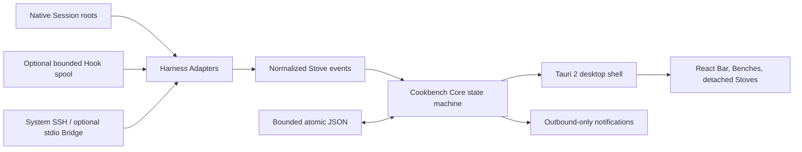

# Cookbench

<p align="center"></p>

<p align="center"><strong>코딩 Agent는 계속 일하고, Cookbench는 그 일을 읽을 수 있게 만듭니다.</strong></p>

<p align="center">
  이미 실행 중인 Agent Session을 위한 작고 로컬 우선인 데스크톱 워크벤치입니다.<br>
  Session 하나는 Stove 하나. 책상 전체에는 Bar 하나. 대화 저장소도, Agent 제어 평면도 없습니다.
</p>

<p align="center">
  <a href="README.md">English</a> · <a href="README.zh-CN.md">简体中文</a> ·
  <a href="README.ja.md">日本語</a> · <a href="README.ko.md">한국어</a>
</p>

<p align="center">
  <a href="https://github.com/finitein/cookbench/actions/workflows/ci.yml"></a>
  <a href="https://github.com/finitein/cookbench/releases"></a>
  <a href="LICENSE"></a>
  
  
</p>


Cookbench는 "Agent를 하나 더 시작했다"와 "어느 터미널이 나를 기다리지?" 사이에
비어 있던 상태 표시 영역입니다. Codex, Claude Code, Pi와 그 밖의 24개 코딩 Agent
표면을 관찰하고, 안전한 생명주기 메타데이터만 정규화하여 각 Session을 작은 **Stove**로
표시합니다. 실제 작업의 주도권은 원래 도구에 그대로 남습니다. Cookbench는 복잡한
Agent 데스크톱을 읽기 쉽게 할 뿐입니다.

- **관찰만 하고 명령하지 않습니다.** Agent를 시작하지 않고, 프롬프트를 보내지 않으며,
  도구를 승인하거나 원격 control(제어) API를 열지 않습니다.
- **원본 Session 파일이 권위 있습니다.** SQLite 대화 저장소도, 복제된 대화 기록도 없습니다.
- **작음을 의도적으로 선택했습니다.** 기록된 macOS arm64 빌드는 디스크 약 18 MiB,
  유휴 RSS 약 90 MiB였습니다. 이는 호스트별 실측치이며 보편적 보장은 아닙니다.
  [성능 증거](docs/verification/performance-macos.md)를 확인하세요.

## 병렬 Agent를 위한 빠진 제어 표면

독립적으로 실행되는 코딩 작업이 열두 개가 넘으면, 터미널 탭은 좋은 대시보드가 아닙니다.
탭 제목은 계속 바뀌고, 백그라운드 작업은 사라지며, 끝난 작업은 유휴 작업처럼 보입니다.
입력이 필요한 단 하나의 Session을 찾는 일은 수동 검색 문제가 됩니다.

Cookbench는 그 책상에 작고 일관된 시각 문법을 제공합니다.

| 개념 | 의미 |
| --- | --- |
| **Session** | Codex, Claude Code, Pi 또는 다른 Harness가 소유한 네이티브 작업 |
| **Stove** | Session 하나의 신원, 생명주기 상태, 활동, 검증된 복귀 대상 |
| **Bench** | 밀도가 높을 때만 Harness별로 묶이는 반응형 Stove 행 |
| **Bar** | 표시되는 모든 Stove를 담는 이동 가능하고 자유롭게 크기 조절되는 전역 표면 |

Bar는 가로·세로 스크롤바 뒤로 작업을 숨기지 않고 여러 행으로 확장됩니다. 데스크톱의
어디로든 옮길 수 있고 일반 창처럼 크기를 조절할 수 있으며, 분리된 독립 Stove와 함께
존재할 수 있습니다. Hover 상세 정보는 선택 사항이며 기본값은 꺼짐이라서 Cookbench가
상태를 알려 주면서도 시야를 점유하지 않습니다.

### 상태 의미는 장식이 아니라 증거입니다

| 상태 | Cookbench가 말하는 것 | 링 |
| --- | --- | --- |
| **Cooking** | 구조화된 증거가 Harness가 작업 중임을 가리킴 | 신뢰할 수 있는 숫자 진행률이 있을 때만 부분 호; 그 외에는 불확정 애니메이션 링 |
| **Needs Human** | Harness가 명시적으로 사람의 주의를 요청함 | 완전한 링 |
| **Cooked** | 권위 있는 완료 이벤트를 관찰함 | 완전한 링; 사용자가 지울 때까지 유지 |
| **Failed** | 구조화된 실패 이벤트를 관찰함 | 완전한 링 |
| **Disconnected** | 로컬 또는 SSH 소스를 더 이상 사용할 수 없음 | 완전한 링; 절대로 Cooked로 조용히 바꾸지 않음 |

장기 Session은 Stove를 고정하여 2일 freshness 제한에서 제외할 수 있습니다. Archive에는
만료되었거나 수동으로 제거한 Session이 보관되며, Restore로 실수로 지운 항목을 되돌릴 수
있습니다. Cooked를 제외한 표시 중 Stove는 원래 Harness Session을 지우지 않고 제거할 수
있습니다.

## Orchestration이 아닌 Observability를 위해 만들었습니다

| Cookbench가 하는 일 | Cookbench가 의도적으로 하지 않는 일 |
| --- | --- |
| 제한된 네이티브 신원과 생명주기 상태 관찰 | Harness를 호스팅, 교체, 감독 또는 제어 |
| 네이티브 Session 파일을 사실의 원본으로 유지 | 전체 프롬프트, 응답, 명령, 대화 기록 복사 |
| 검증된 Session-창 신원 체인으로 복귀 | 추측한 터미널을 정확한 일치라고 주장 |
| 선택적 로컬 및 outbound-only 알림 발송 | 채팅 명령 수신, 받은편지함 폴링, 원격 Agent 조작 |
| 시스템 SSH로 원격 Session 검사 | SSH 비밀번호 저장 또는 수신 포트 열기 |
| 설정, 고정, Archive, 배치를 위한 제한된 atomic JSON 저장 | SQLite 대화 웨어하우스 구축 |

이는 빠진 로드맵 항목이 아니라 의도적인 아키텍처 경계입니다. 정확한 계약은
[개인정보 보호](docs/privacy.md), [보안](docs/security.md),
[설치/SSH](docs/installing.md) 문서에 있습니다.

## 한 줄로 설치

Cookbench v0.3.0은 서명되지 않은 프리뷰입니다. 첫 번째 파티 bootstrap은
`release-manifest.json`을 내려받아 이 시스템에 맞는 네이티브 패키지를 선택하고,
SHA-256 digest를 검증한 다음 설치합니다.

macOS universal 또는 그래픽 Ubuntu/Linux x86_64:

```bash
curl -fsSL https://github.com/finitein/cookbench/releases/download/v0.3.0/install.sh | COOKBENCH_VERSION=v0.3.0 COOKBENCH_ALLOW_PRERELEASE=1 bash
```

Windows x64 PowerShell:

```powershell
$env:COOKBENCH_VERSION='v0.3.0'; $env:COOKBENCH_ALLOW_PRERELEASE='1'; irm https://github.com/finitein/cookbench/releases/download/v0.3.0/install.ps1 | iex
```

macOS/Linux에서는 `--dry-run`, 모든 플랫폼에서는 `COOKBENCH_DRY_RUN=1`으로 실제 설치
없이 artifact 선택을 점검할 수 있습니다. 프리뷰 패키지는 서명되지 않았을 수 있습니다.
안정판, 소스 빌드, 플랫폼 런타임, SSH, 제거에 관한 자세한 내용은
[Cookbench 설치](docs/installing.md)를 확인하세요. Cookbench는 아직 Homebrew, winget,
APT 저장소에 배포되지 않으므로, 동작하지 않는 설치 명령은 이 저장소에서 홍보하지 않습니다.

## 요리를 시작하세요

1. Cookbench를 실행한 뒤 평소처럼 코딩 Agent를 사용합니다.
2. **Session roots**를 비워 두면 Codex, Claude Code, Pi의 표준 네이티브 root를 자동
   탐색합니다. 다른 profile은 문서화된 Hook, manual, presence 경로를 사용하며 비표준
   레이아웃일 때만 절대 root를 추가합니다.
3. **Settings > Sources**에서 로컬 및 SSH 탐색을 확인하고, **Settings > Hook Health**에서
   실제로 어떤 생명주기 신호가 존재하는지 확인합니다.
4. Stove를 클릭하면 가능한 경우 검증된 터미널/IDE 대상을 사용하고, 그렇지 않으면 보호된
   Codex Desktop 작업 탐색 또는 명시적 애플리케이션/프로젝트 fallback을 사용합니다.
5. Settings에서 언어, 선택적 Hover 상세 정보, 2일 freshness, Archive, 소리, 시스템 배너,
   Bar 점멸, 데스크톱 주의 요청을 조절합니다.

로컬 알림의 기본값은 소리만 켜짐입니다. Cooked Stove는 클릭해 확인할 때까지 계속 점멸할 수
있습니다. 일시 오류 메시지는 Bar 아래를 영구 점유하지 않고 20초 뒤 사라집니다.

## 정직한 Capability Tier를 가진 27개 Harness Profile

"지원"이라는 말은 무엇을 관찰하는지, 생명주기를 어떻게 추론하는지, 복귀가 검증 가능한지를
함께 말하지 않으면 의미가 없습니다. Cookbench는 모든 통합을 같은 초록색으로 칠하지 않고
그 차이를 공개합니다.

| Tier | 포함 표면 | 계약 |
| --- | --- | --- |
| **Full (14)** | Codex, Claude Code, Pi, Gemini CLI, Qwen Code, Kimi Code CLI, Qoder, ZCode, Factory Droid, CodeBuddy, Cursor, GitHub Copilot CLI, OpenCode, Cline | 구조화된 신원·생명주기 계약; 고유하고 검증된 locator가 있을 때만 정확 복귀 |
| **Standard (12)** | Trae, Grok CLI, Goose, Aider, Kiro, Amazon Q Developer, Roo Code, Continue, Amp, Mistral Vibe, Crush, OpenHands CLI | 보호된 앱, 프로젝트, IDE 또는 터미널 복귀를 갖는 구조화된 관찰 |
| **Experimental (1)** | Tencent WorkBuddy | 공개된 구조화 신원·생명주기 계약이 생길 때까지 presence-only |

Cookbench는 Codex, Claude Code, Pi, Kimi Code, ZCode에 대해서만 자체 소유 Hook 항목을
자동 preview, 설치, 복구, 제거할 수 있습니다. 관련 없는 Harness 설정은 보존합니다. 다른
구조화 Profile은 가짜 초록 체크 대신 Hook Health에서 manual로 표시됩니다. 내부 subagent의
시작/종료 이벤트는 무시하므로 부모 Session의 worker가 중복 Stove로 Bar를 채우지 않습니다.

정식 [호환성 매트릭스](docs/harness-compatibility.md)와
[Hook 통합 계약](docs/integrations/hooks.md)을 확인하세요.

## 마술적 추측 없이 정확히 복귀

정확한 jump는 신원 문제입니다. Cookbench는 호스트가 제공하는 가장 강한 체인을 만듭니다.

```text
native Session ID
    -> process / PID metadata
    -> terminal, pane, tab, IDE, 또는 Codex Desktop locator
    -> 호스트가 지원하는 경우 post-focus verification
```

이 체인이 고유하고 검증 가능하면 Stove를 클릭해 바로 그 작업 표면으로 돌아갑니다. 모호할
경우 Cookbench는 추측을 "정확"이라고 부르지 않고, 보호된 앱, 프로젝트, 터미널, resume
동작으로 fallback합니다. 권한 상승 Windows 터미널, 지원하지 않는 터미널 탭 API, 일부
Wayland compositor는 필연적으로 정밀도를 제한합니다. Codex Desktop 작업 URL은 보호된
visible fallback이며, 선택된 작업 검증은 기록된 manual gap으로 남아 있습니다.

## 로컬, SSH, 알림

### 로컬 소스

Adapter는 표준 네이티브 root와 선택적인 Cookbench 소유 Hook spool을 감시합니다. Session
파일은 계속 권위 있습니다. Hook은 제한된 생명주기 및 locator 메타데이터를 내보내고,
ingestion 때 내용을 필터링하며, 관련 없는 설정을 보존하고 Hook Health에서 복구 또는 제거할
수 있습니다.

### SSH 소스

Cookbench는 기존 시스템 `ssh`를 통해 두 원격 모드를 지원합니다.

- **무설치 읽기 전용:** 명시적으로 선택했거나 자동 탐색된 네이티브 root를 원격 shell
  명령으로 검사합니다.
- **선택적 단일 파일 Bridge:** checksum으로 검증한 helper를 업로드하고 버전이 있는 읽기
  전용 프로토콜로 SSH stdin/stdout에서 통신합니다.

어느 모드도 SSH 비밀번호를 저장하지 않고, 포트를 열지 않으며, Agent를 제어하지 않고,
연결 해제를 성공적인 완료로 바꾸지 않습니다.

### 알림

로컬 channel에는 소리, 시스템 배너, Bar 점멸, 데스크톱 attention이 있습니다. outbound
상태 알림은 Telegram, Slack, Discord, Lark/Feishu, Generic Webhook을 지원합니다. 이들은
보내기만 합니다. Cookbench에는 inbound 메시지 listener, command loop, 원격 제어 경로가
없습니다. 대상 credential은 가능할 때 네이티브 secret store를 사용합니다.

## 90초 아키텍처



- **Core:** Rust workspace가 신원, 상태 전이, Adapter 계약, redaction, SSH 프로토콜,
  알림 정책을 담당합니다.
- **Desktop:** Tauri 2가 네이티브 창, tray, focus 통합, secret storage 접근, 패키징을
  제공하고 React가 가벼운 표면을 렌더링합니다.
- **Storage:** 제한된 atomic JSON은 설정, pin/archive 상태, 표시 배치, 최소 검증 locator를
  저장합니다. SQLite 데이터베이스는 없습니다.
- **Platforms:** macOS, Windows, 그래픽 Ubuntu/Linux가 V1의 1급 대상입니다. GNOME
  Wayland에는 선택적 presentation extension과 명시적인 best-effort 제한이 있습니다.

## Agent에게

Cookbench는 Agent 곁에서 안전하게 동작하도록 의도적으로 설계되었습니다. 이 저장소를 읽는
Agent라면, 다음을 단순한 기여자 예절이 아니라 제품 계약으로 취급하세요.

### 계약

- **진실:** Harness의 네이티브 Session 파일이 권위 있습니다. Cookbench 상태는 표시
  메타데이터, 환경설정, pin, archive, 최소 검증 복귀 locator일 뿐입니다.
- **개인정보:** 원본 프롬프트, transcript, 코드, 명령, tool I/O, token, credential,
  private key, webhook endpoint, 실제 사용자 Session fixture를 진단, 테스트, issue,
  commit, pull request에 절대 넣지 마세요.
- **주도권:** Agent에게 프롬프트를 보내거나, 승인하거나, 시작·중지·호스팅·교체·제어하는
  경로를 추가하지 마세요.
- **복귀:** Session-창 신원 체인이 검증되었을 때만 exact return을 주장하세요. 그렇지
  않으면 명시적인 프로젝트, 앱, 터미널, resume fallback을 노출하세요.
- **Hooks:** Cookbench 소유 Hook은 제한된 생명주기 메타데이터만 spool에 기록할 수
  있습니다. 관련 없는 Harness 설정을 보존하고 깨끗하게 제거될 수 있어야 합니다.
- **원격:** SSH 관찰은 읽기 전용입니다. 선택적 Bridge는 버전이 있는 SSH stdio를 쓰고,
  포트를 열지 않으며 원격 제어 명령을 받지 않습니다.
- **알림:** 알림은 outbound-only입니다. inbound webhook listener, chat polling, command
  processing을 추가하지 마세요.
- **상태 UI:** 신뢰할 수 있는 구조화 Cooking 진행률만 불완전한 호를 사용할 수 있습니다.
  Needs Human, Cooked, Failed, Disconnected는 항상 완전한 링입니다.

### Harness Adapter 추가하기

Adapter가 기여하는 것은 Agent 대화의 개인 복사본이 아니라 정규화된 관찰 계약입니다.

1. catalog에 안정적인 profile과 capability tier를 등록합니다.
2. 문서화된 네이티브 root 또는 명시적 절대 경로 override만 탐색합니다.
3. 필요한 최소 범위의 신원과 생명주기 필드만 파싱합니다.
4. confidence와 fallback 동작을 정직하게 보고합니다.
5. 상관관계와 검증이 가능한 경우에만 exact locator를 발행합니다.
6. 합성된 메타데이터 전용 fixture, redaction test, 상태 test, 알려진 제한 문서를
   추가합니다.
7. 선택적 Hook 설치는 소유권이 분명하고 되돌릴 수 있으며 Harness의 관련 없는 설정과
   분리되게 유지합니다.

[AGENTS.md](AGENTS.md), [호환성 매트릭스](docs/harness-compatibility.md),
[Hook 규칙](docs/integrations/hooks.md), [보안 경계](docs/security.md),
[개인정보 경계](docs/privacy.md)부터 읽으세요. 전체 계약은
`./scripts/verify.sh`로 검증합니다. 이 저장소의 commit은 `AGENTS.md`에 정의된 Lore
Commit Protocol을 따릅니다.

## 오픈 소스는 내 것으로 만들 수 있다는 뜻입니다

Cookbench 전체는 MIT 라이선스입니다. 그대로 사용하고, 모든 신뢰 경계를 검토하고,
개인 Harness Adapter를 추가하고, visual shell을 조정하고, 새 locale을 번역하거나,
자신의 기계 안에 머무르는 DIY workflow를 만들 수 있습니다. 이 시스템은 호스팅된 제어
평면을 발굴하지 않아도 이해할 수 있을 만큼 작게 유지됩니다.

```bash
corepack enable
pnpm install
pnpm lint
pnpm test --run
pnpm build
cargo fmt --all -- --check
cargo clippy --workspace --all-targets -- -D warnings
cargo test --workspace
```

전체 로컬 release gate는 `./scripts/verify.sh`입니다. 패키지 관련 주장을 하기 전에는
[Cookbench 릴리스](docs/releasing.md)를 읽으세요.

## 13장의 Cookbench 프레임

아래에는 AI 입문자, 매일 Agent를 쓰는 사람, 병렬 Session이 많아 진짜 Bench가 필요한
사람을 위한 완전한 중국어 시각 투어가 있습니다. 모든 카드는 Cookbench mark, 시스템 글꼴,
CSS만으로 수정 가능한 HTML에서 offline 생성되었습니다. 소스와 결정론적 renderer는
[docs/showcase](docs/showcase/README.md)에 있습니다.

<details>
<summary><strong>13장 전체 제품 투어 열기</strong></summary>

<table>
  <tr><td></td><td></td></tr>
  <tr><td></td><td></td></tr>
  <tr><td></td><td></td></tr>
  <tr><td></td><td></td></tr>
  <tr><td></td><td></td></tr>
  <tr><td></td><td></td></tr>
  <tr><td></td><td></td></tr>
</table>

</details>

## 느낌이 아니라 증거

Cookbench는 오픈 소스 프리뷰입니다. 자동 CI는 Rust와 TypeScript test, 상태 머신,
Adapter 계약, redaction, packaging 규칙, GNOME 프로토콜, production build 격리,
Chromium interaction flow를 다룹니다. 현재 기록된 네이티브 증거는 macOS와 Ubuntu X11을
포함합니다.

Windows 그래픽 실행, GNOME Wayland 동작, 모든 터미널 구현에서의 exact focus,
multi-monitor 복원, live remote SSH, 네이티브 notification center, provider sandbox는
현재 증거가 불완전한 명시적 수동 release gate입니다. 브라우저 테스트가 초록이라고 해서
네이티브 플랫폼 통과로 보고하지 않습니다.

[17개 항목 acceptance checklist](docs/verification/release-checklist.md),
[성능 baseline](docs/verification/performance-macos.md),
[릴리스 절차](docs/releasing.md)를 읽으세요.

## 라이선스

Cookbench는 [MIT License](LICENSE)로 배포됩니다. 제3자 고지는
[THIRD_PARTY_NOTICES.md](THIRD_PARTY_NOTICES.md)에 기록되어 있습니다.
