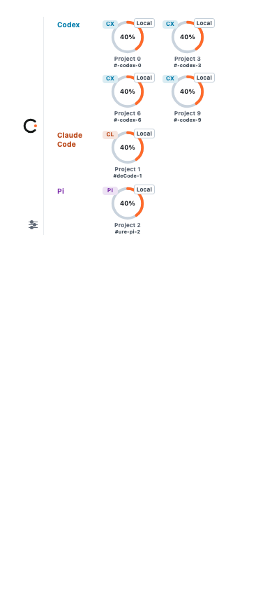

# Cookbench

<p align="center"></p>
<p align="center"><a href="README.md">English</a> · <a href="README.zh-CN.md">简体中文</a> · <a href="README.ja.md">日本語</a> · <a href="README.ko.md">한국어</a></p>

Cookbench는 이미 사용 중인 코딩 Agent를 위한 가벼운 데스크톱 동반자입니다.
각 세션을 작은 **Stove**로 보여 주어 실행 중, 확인 필요, 완료 상태를 한눈에
파악합니다. 원래 도구가 항상 control을 가지며 Cookbench는 Agent를 호스팅하거나
프롬프트 전송, 도구 승인, 원격 조작을 하지 않습니다.



## 주요 기능

- 여러 Harness의 Session을 하나의 간결한 Bar에서 확인합니다.
- 신원을 검증할 수 있을 때만 원래 터미널, IDE, Codex Desktop 작업으로 정확히 복귀합니다.
- Bar를 이동하고 일반 창처럼 자유롭게 크기 조절합니다. Stove가 많으면 자동 줄바꿈하고
  스크롤바 없이 전체를 표시합니다.
- Cooked는 직접 지울 때까지 유지하며 장기 작업 고정과 Archive 복원을 지원합니다.
- 소리, 시스템 배너, Bar 점멸, 시스템 주의 요청을 선택합니다. 완료 점멸은 클릭까지 유지됩니다.
- SSH는 원격 무설치 읽기 전용 방식과 포트 없이 SSH stdio만 쓰는 bridge를 지원합니다.

## 27개 Harness Profile

**Full**, **Standard**, **Experimental** 3단계로 27개 도구의 신원, 생명주기,
복귀 능력을 표현하며 모든 도구가 같다고 주장하지 않습니다.

| Tier | 도구 |
| --- | --- |
| Full (14) | Codex, Claude Code, Pi, Gemini CLI, Qwen Code, Kimi Code CLI, Qoder, ZCode, Factory Droid, CodeBuddy, Cursor, GitHub Copilot CLI, OpenCode, Cline |
| Standard (12) | Trae, Grok CLI, Goose, Aider, Kiro, Amazon Q Developer, Roo Code, Continue, Amp, Mistral Vibe, Crush, OpenHands CLI |
| Experimental (1) | Tencent WorkBuddy, 현재 presence-only |

Codex, Claude Code, Pi, Kimi Code, ZCode는 Cookbench 소유 Hook 자동 설정을
지원합니다. 나머지는 Hook Health에 수동 연결 상태로 표시됩니다. 자세한 내용은
[호환성 매트릭스](docs/harness-compatibility.md)를 확인하세요.

## 한 줄 프리뷰 설치

```bash
# macOS universal / GUI Ubuntu Linux x86_64
curl -fsSL https://github.com/finitein/cookbench/releases/download/v0.2.1/install.sh | COOKBENCH_VERSION=v0.2.1 COOKBENCH_ALLOW_PRERELEASE=1 bash
```

```powershell
# Windows x64 PowerShell
$env:COOKBENCH_VERSION='v0.2.1'; $env:COOKBENCH_ALLOW_PRERELEASE='1'; irm https://github.com/finitein/cookbench/releases/download/v0.2.1/install.ps1 | iex
```

`release-manifest.json`에서 네이티브 패키지를 선택하고 SHA-256 검증 후 설치합니다.
프리뷰는 서명되지 않았을 수 있습니다. [설치 문서](docs/installing.md)를 참고하세요.

## 로컬 우선 경계

네이티브 Session 파일이 사실의 원본입니다. 제한된 표시 메타데이터, 설정,
고정/Archive 상태, 최소 복귀 locator만 저장합니다. SQLite 대화 DB, 전체 대화 복사,
원격 측정, 수신 메시지, 원격 control API는 없습니다.

Session roots를 비워 두면 표준 경로를 자동 검색합니다. 호버 상세 정보는 기본으로
꺼져 있고 알림은 소리만 켜져 있으며 일시 오류는 20초 뒤 사라집니다.

[개인정보 보호](docs/privacy.md), [보안](docs/security.md),
[12개 소개 이미지와 HTML](docs/showcase/README.md),
[릴리스 체크리스트](docs/verification/release-checklist.md)를 확인하세요.

[MIT License](LICENSE)를 사용하는 오픈 소스 프리뷰입니다. macOS와 Ubuntu X11은
실기 검증 증거가 있으며 Windows와 GNOME Wayland의 공백은 명확히 기록합니다.
