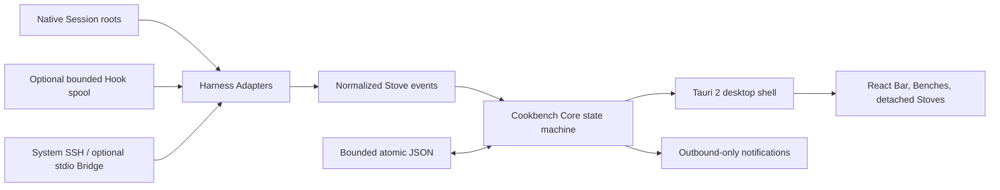

# Cookbench

<p align="center"></p>

<p align="center"><strong>Your coding agents keep working. Cookbench keeps them legible.</strong></p>

<p align="center">
  A tiny, local-first desktop workbench for the agent sessions you already run.<br>
  One Session, one Stove. One Bar for the whole desk. No transcript warehouse. No agent control plane.
</p>

<p align="center">
  <a href="README.md">English</a> · <a href="README.zh-CN.md">简体中文</a> ·
  <a href="README.ja.md">日本語</a> · <a href="README.ko.md">한국어</a>
</p>

<p align="center">
  <a href="https://github.com/finitein/cookbench/actions/workflows/ci.yml"></a>
  <a href="https://github.com/finitein/cookbench/releases"></a>
  <a href="LICENSE"></a>
  
  
</p>


Cookbench is the missing status surface between "I started another agent" and
"which terminal is waiting for me?" It observes Codex, Claude Code, Pi, and 24
other coding-agent surfaces, normalizes safe lifecycle metadata, and renders
every session as a compact **Stove**. Your original tools continue to own the
work. Cookbench simply makes a crowded agentic desktop readable.

- **Observe, never command.** Cookbench does not start agents, send prompts,
  approve tools, or expose a remote-control API.
- **Native files stay authoritative.** There is no SQLite transcript store and
  no copied conversation history.
- **Small by design.** The recorded macOS arm64 build occupies about 18 MiB on
  disk and measured about 90 MiB idle RSS. These are host-specific measurements,
  not universal promises. Read the [performance evidence](docs/verification/performance-macos.md).

## The Missing Control Surface for Parallel Agents

Terminal tabs are a bad dashboard for a dozen independent coding runs. Their
titles drift, background work disappears, completed tasks look like idle tasks,
and finding the one session that needs input becomes a manual search problem.

Cookbench gives that desk a small visual grammar:

| Concept | Meaning |
| --- | --- |
| **Session** | A native task owned by Codex, Claude Code, Pi, or another Harness |
| **Stove** | One session's identity, lifecycle state, activity, and verified return target |
| **Bench** | A responsive row of Stoves, grouped by Harness only when density requires it |
| **Bar** | The movable, freely resizable global surface containing every visible Stove |

The Bar expands into multiple rows instead of hiding work behind horizontal or
vertical scrollbars. It can move anywhere, resize like a normal desktop window,
and coexist with independently detached Stoves. Hover details are optional and
off by default, so Cookbench stays useful without becoming visual noise.

### State semantics are evidence, not decoration

| State | What Cookbench is saying | Ring |
| --- | --- | --- |
| **Cooking** | Structured evidence says the Harness is working | Partial only when reliable numeric progress exists; otherwise animated indeterminate ring |
| **Needs Human** | The Harness explicitly needs attention | Complete ring |
| **Cooked** | An authoritative completion event was observed | Complete ring; remains until you clear it |
| **Failed** | A structured failure event was observed | Complete ring |
| **Disconnected** | A local or SSH source became unavailable | Complete ring; never silently converted to Cooked |

Pin a long-lived Stove to exempt it from the two-day freshness limit. Archive
stores expired or manually removed sessions, and Restore brings back an
accidental removal. Except for Cooked sessions, visible Stoves can be removed
without deleting the original Harness session.

## Focus the Desk, Without Losing It

**Full** remains the default: it lists every visible Stove and grows into
Benches instead of hiding work. Turn on **Minimal** when one circular Stove is
enough. It shows the shared attention priority, in this order: Needs Human,
Failed, Disconnected, unacknowledged Cooked, active work, then acknowledged
Cooked; newer state evidence breaks ties. It does not use a timed carousel, and
its priority menu keeps the other Stoves reachable.

Drag the global Bar to the top of its current monitor to dock it. A drop within
12 px docks; after 600 ms it auto-hides and the top 3 px reveals it again.
Pulling the Bar 24 px away undocks it. Detached Stoves keep their usual movable
behavior. Wayland docking is best effort because the compositor owns that
interaction. v0.4.2 fixes macOS auto-hide by using a native three-pixel trigger
instead of asking AppKit to move a visible window beyond the top screen edge.
Linux/X11 first tries the same off-screen slide; when a WM clamps the window so
more than the trigger stays visible (observed with xfwm4), Cookbench shrinks in
place to the three-pixel trigger at the dock edge — same contract as macOS.

The v0.4.1 safety hotfix, retained in v0.4.2, temporarily suspends dynamic macOS
status-bar Stove rendering after a WindowServer crash was reproduced on
mirrored dual displays. The proven static Cookbench tray and menu remain
available. A saved 0-to-8 Stove count (default 3) is retained for a later,
separately verified return; Minimal mode and top docking are unaffected.

## Built for Observability, Not Orchestration

| Cookbench does | Cookbench deliberately does not do |
| --- | --- |
| Observe bounded native identity and lifecycle state | Host, replace, supervise, or control a Harness |
| Keep native Session files as the source of truth | Copy full prompts, responses, commands, or transcripts |
| Return through a verified session-to-window identity chain | Claim that a guessed terminal is an exact match |
| Send optional local and outbound-only notifications | Receive chat commands, poll an inbox, or operate an Agent remotely |
| Inspect remote sessions through system SSH | Store SSH passwords or open a listening port |
| Store bounded atomic JSON for preferences, pins, archive, and placement | Build a SQLite conversation warehouse |

This is a deliberate architecture boundary, not a missing roadmap item. Read
the exact [privacy](docs/privacy.md), [security](docs/security.md), and
[installation/SSH](docs/installing.md) contracts.

## Install in One Command

The latest preview is [v0.4.5](https://github.com/finitein/cookbench/releases/tag/v0.4.5)
for **Linux and Windows** (unsigned preview packages on GitHub Releases). macOS
assets for 0.4.5 ship separately; until then, Apple silicon users can keep using
an earlier Mac preview or build from source.

Prefer the GitHub Releases page for v0.4.5, or pin the first-party bootstrap:

graphical Ubuntu/Linux x86_64:

```bash
curl -fsSL https://github.com/finitein/cookbench/releases/download/v0.4.5/install.sh | COOKBENCH_VERSION=v0.4.5 COOKBENCH_ALLOW_PRERELEASE=1 bash
```

Windows x64 PowerShell:

```powershell
$env:COOKBENCH_VERSION='v0.4.5'; $env:COOKBENCH_ALLOW_PRERELEASE='1'; irm https://github.com/finitein/cookbench/releases/download/v0.4.5/install.ps1 | iex
```

Use `--dry-run` on Linux or `COOKBENCH_DRY_RUN=1` on any platform to inspect
artifact selection without installation. Preview packages may be unsigned;
stable, source-build, platform-runtime, SSH, and removal details live in
[Installing Cookbench](docs/installing.md). Cookbench is not yet published to
Homebrew, winget, or an APT repository, so the repository does not advertise
commands that do not work yet.

## Start Cooking

1. Launch Cookbench, then use your coding agents normally.
2. Leave **Session roots** empty to discover the standard native roots for
   Codex, Claude Code, and Pi. Other catalog profiles use their documented Hook,
   manual, or presence path; add absolute roots only for nonstandard layouts.
3. Open **Settings → Local Sources** to inspect local discovery (and SSH Sources
   where configured), then **Settings → Hook Health** to see which lifecycle
   signals actually exist.
4. Click a Stove to use a verified terminal/IDE target where available, guarded
   Codex Desktop task navigation, or an explicit application/project fallback.
5. Tune language, Full or Minimal display, top docking, optional hover details,
   two-day freshness, Archive, sound, system banners, Bar flash, and desktop
   attention from Settings. macOS status-bar Stove count remains temporarily
   suspended where that preference still exists.

Local notifications default to sound only. A Cooked Stove may keep flashing
until you acknowledge it by clicking that Stove. Temporary error messages
expire after 20 seconds rather than occupying a permanent row below the Bar.

## 27 Harness Profiles, with Honest Capability Tiers

"Supported" is not useful unless it says what is observed, how lifecycle is
inferred, and whether return can be verified. Cookbench publishes those
differences instead of painting every integration green. The tiers below are
**protocol capabilities**, not a claim that every one of 27 profiles has been
run on every host, operating system, Harness version, and terminal.

| Tier | Included surfaces | Contract |
| --- | --- | --- |
| **Full (14)** | Codex, Claude Code, Pi, Gemini CLI, Qwen Code, Kimi Code CLI, Qoder, ZCode, Factory Droid, CodeBuddy, Cursor, GitHub Copilot CLI, OpenCode, Cline | Structured identity and lifecycle contract; exact return only with a unique verified locator |
| **Standard (12)** | Trae, Grok Build, Goose, Aider, Kiro, Amazon Q Developer, Roo Code, Continue, Amp, Mistral Vibe, Crush, OpenHands CLI | Structured observation with a guarded app, project, IDE, or terminal return |
| **Experimental (1)** | Tencent WorkBuddy | Presence-only until a public structured identity and lifecycle contract exists |

Cookbench can automatically preview, install, repair, and uninstall only its
own Hook entries for Codex, Claude Code, Pi, Kimi Code, and ZCode. It preserves
unrelated Harness configuration. Other structured profiles appear in Hook
Health as manual rather than receiving a fake green check. Internal subagent
start/stop events are ignored so a parent session's workers do not flood the
Bar with duplicate Stoves.

Read the capability table in four independent dimensions:

| Dimension | What it proves | Where to check it |
| --- | --- | --- |
| Tier | The catalog's observation and return contract | This table and the compatibility matrix |
| Hook setup | Whether Cookbench can manage only its own configuration entry automatically, or requires manual setup | Hook Health on this machine |
| Local readiness | Whether this machine found a usable native root and lifecycle signal | Sources and Hook Health on this machine |
| Verification evidence | Whether synthetic fixtures exercise the parser, or a recorded native run covers a specific host path | Tests and the release checklist |

For example, current `main` includes Grok Build discovery and lifecycle parsing
from its locally observed native metadata root. It remains **Standard**: exact return is
available only after unique correlation and host-side verification. A fixture
or a successful run on one macOS terminal does not prove that return path on
Windows, Linux, or another terminal. The [release checklist](docs/verification/release-checklist.md)
records the native evidence and remaining manual gaps.
See the scoped [macOS main verification record](docs/verification/macos-main-2026-09-08.md).

Grok Build terminal correlation currently checks the standard `.grok/sessions`
layout. Custom `GROK_HOME` roots can be discovered, but return remains a guarded
fallback. Multiple open sessions in one process, incomplete process inspection,
or ambiguous identity also prevent an exact-return claim.

See the canonical [compatibility matrix](docs/harness-compatibility.md) and
[Hook integration contract](docs/integrations/hooks.md).

## Exact Return, without Magical Thinking

Precise jumping is an identity problem. Cookbench builds the strongest chain
the host exposes:

```text
native Session ID
    -> process / PID metadata
    -> terminal, pane, tab, IDE, or Codex Desktop locator
    -> post-focus verification where the host supports it
```

When that chain is unique and verifiable, clicking the Stove returns to the
specific work surface. When it is ambiguous, Cookbench refuses to call a guess
"exact" and falls back to a guarded app, project, terminal, or resume action.
Elevated Windows terminals, unsupported terminal-tab APIs, and some Wayland
compositors necessarily limit precision. Codex Desktop task URLs are a guarded
visible fallback; selected-task verification remains a recorded manual gap.

## Local, SSH, and Notifications

### Local sources

Adapters watch standard native roots and optional Cookbench-owned Hook spools.
Session files remain authoritative. Hooks emit bounded lifecycle and locator
metadata, filter content at ingestion, preserve unrelated configuration, and
can be repaired or removed from Hook Health.

### SSH sources

Cookbench supports two remote modes through your existing system `ssh`:

- **Zero-install read-only:** scan explicitly selected or automatically
  discovered native roots using remote shell commands.
- **Optional single-file Bridge:** upload a checksum-verified helper and speak a
  versioned, read-only protocol over SSH stdin/stdout.

Neither mode stores an SSH password, listens on a port, controls an Agent, or
turns a disconnect into a successful completion.

### Notifications

Local channels include sound, system banner, Bar flash, and desktop attention.
Outbound state notifications support Telegram, Slack, Discord, Lark/Feishu,
and Generic Webhook. They send only; Cookbench has no inbound message listener,
command loop, or remote-control route. Destination credentials use the native
secret store when available.

## Architecture in 90 Seconds



- **Core:** a Rust workspace owns identities, state transitions, adapter
  contracts, redaction, SSH protocol, and notification policy.
- **Desktop:** Tauri 2 provides native windows, tray, focus integration, secret
  storage access, and packaging; React renders the lightweight surfaces.
- **Storage:** bounded atomic JSON stores settings, pin/archive state, display
  placement, and minimum verified locators. There is no SQLite database.
- **Platforms:** macOS, Windows, and graphical Ubuntu/Linux are first-class V1
  targets. GNOME Wayland has an optional presentation extension and explicit
  best-effort limits.

## For Agents / 写给 Agent

Cookbench is intentionally safe to live beside an Agent. If you are an Agent
reading this repository, treat the following as part of the product contract,
not merely contributor etiquette.

### Contract

- **Truth:** the Harness's native Session file is authoritative. Cookbench state
  is presentation metadata, preferences, pins, archives, and minimum verified
  return locators.
- **Privacy:** never put raw prompts, transcripts, code, commands, tool I/O,
  tokens, credentials, private keys, webhook endpoints, or real user Session
  fixtures in diagnostics, tests, issues, commits, or pull requests.
- **Agency:** do not add paths that prompt, approve, start, stop, host, replace,
  or otherwise control an Agent.
- **Return:** claim exact return only when the Session-to-window identity chain
  is verified. Otherwise expose an explicit project, app, terminal, or resume
  fallback.
- **Hooks:** Cookbench-owned Hooks may emit bounded lifecycle metadata to the
  spool. They must preserve unrelated Harness configuration and be removable
  cleanly.
- **Remote:** SSH observation is read-only. The optional Bridge uses versioned
  SSH stdio, opens no port, and accepts no remote-control commands.
- **Notifications:** notifications are outbound-only. Do not add an inbound
  webhook listener, chat polling, or command processing.
- **State UI:** only reliable structured Cooking progress may use an incomplete
  arc. Needs Human, Cooked, Failed, and Disconnected always use complete rings.

### Add a Harness Adapter

An adapter contributes a normalized observation contract, not a private copy
of the Agent's conversation:

1. Register a stable profile and capability tier in the catalog.
2. Discover only the documented native root or an explicit absolute override.
3. Parse the minimum bounded identity and lifecycle fields required.
4. Report confidence and fallback behavior honestly.
5. Emit an exact locator only when it can be correlated and verified.
6. Add synthetic, metadata-only fixtures, redaction tests, state tests, and
   documentation for known gaps.
7. Keep optional Hook installation owned, reversible, and isolated from the
   Harness's unrelated configuration.

### Adapt a User's Host, Within Its Boundaries

An Agent may adapt Cookbench for the Harnesses a user actually uses, including
Cline or ZCode, when the catalog has not received recorded native evidence for
that user's platform. Do this as a host-specific contribution, not as a new
cross-platform support promise:

1. Identify the user's Harness, version, platform, terminal or IDE, and the
   requested observation or return behavior before changing anything.
2. Inspect only the minimum read-only metadata needed to establish the native
   root, identity, lifecycle, and locator contract. Never copy a real session,
   private path, ID, command, tool input/output, or credential into the repo,
   fixtures, logs, or diagnostics.
3. Reuse the adapter catalog, reducers, locator rules, and Hook ownership
   pattern. Add synthetic metadata-only fixtures and failure regressions before
   relying on a live session.
4. Within the user's authorized target, make low-risk local edits, run focused
   tests, build, and verify without asking for confirmation at every step. Keep
   a clear revert or Hook-uninstall path.
5. Obtain explicit authorization before credential, permission, security,
   destructive, or production changes. Preserve every Hook entry Cookbench
   does not own.
6. Keep native sessions authoritative and Cookbench observational: never start
   a Harness, send a prompt, approve an action, or add remote control. Emit an
   exact return only after unique correlation and verification; otherwise use a
   guarded fallback.
7. Record the exact host scope, run `./scripts/verify.sh`, and name manual
   native gaps. Do not generalize one host's result into a platform-wide claim.

Start with [AGENTS.md](AGENTS.md), the
[compatibility matrix](docs/harness-compatibility.md),
[Hook rules](docs/integrations/hooks.md), [security boundary](docs/security.md),
and [privacy boundary](docs/privacy.md). Verify the whole contract with
`./scripts/verify.sh`. Commits in this repository follow the Lore Commit
Protocol defined in `AGENTS.md`.

## Open Source Means You Can Make It Yours

Cookbench is MIT-licensed end to end. Use it unchanged, inspect every trust
boundary, add a private Harness Adapter, tune the visual shell, translate a new
locale, or DIY a workflow that remains on your own machines. The system is
intentionally small enough to understand without excavating a hosted control
plane.

```bash
corepack enable
pnpm install
pnpm lint
pnpm test --run
pnpm build
cargo fmt --all -- --check
cargo clippy --workspace --all-targets -- -D warnings
cargo test --workspace
```

The full local release gate is `./scripts/verify.sh`. See
[Releasing Cookbench](docs/releasing.md) before making package claims.

## Cookbench in 14 Frames

The complete Chinese visual tour is included below for AI newcomers, daily
Agent users, and people running enough parallel sessions to need a real bench.
Every card is generated offline from editable HTML using the Cookbench mark,
system fonts, and CSS only. The source and deterministic renderer live in
[docs/showcase](docs/showcase/README.md).

<details>
<summary><strong>Open the complete 14-image product tour</strong></summary>

<table>
  <tr><td></td><td></td></tr>
  <tr><td></td><td></td></tr>
  <tr><td></td><td></td></tr>
  <tr><td></td><td></td></tr>
  <tr><td></td><td></td></tr>
  <tr><td></td><td></td></tr>
  <tr><td></td><td></td></tr>
</table>

</details>

The 23.5-second vertical [focus-surface film with Mandarin voiceover](videos/cookbench-focus-surfaces/renders/cookbench-focus-surfaces-vertical-narrated.mp4)
uses a restrained, slightly brisk Qwen3-TTS delivery. Its dynamic macOS status
Stove segment remains a release archive while that runtime has been suspended
since v0.4.1; Minimal mode and top docking remain current. The original
[silent-first cut](videos/cookbench-focus-surfaces/renders/cookbench-focus-surfaces-vertical.mp4)
is retained too.

## Evidence, Not Vibes

Cookbench is an open-source preview. Automated CI covers Rust and TypeScript
tests, state machines, adapter contracts, redaction, packaging rules, GNOME
protocol, production build isolation, and Chromium interaction flows. Recorded
native evidence currently covers macOS and Ubuntu X11.

Windows graphical launch, GNOME Wayland behavior, exact focus across every
terminal implementation, multi-monitor restoration, live remote SSH, native
notification centers, and provider sandboxes remain explicit manual release
gates where current evidence is incomplete. A green browser test is never
reported as a native platform pass.

Read the [17-point acceptance checklist](docs/verification/release-checklist.md),
[performance baseline](docs/verification/performance-macos.md), and
[release process](docs/releasing.md).

## License

Cookbench is released under the [MIT License](LICENSE). Third-party attribution
is recorded in [THIRD_PARTY_NOTICES.md](THIRD_PARTY_NOTICES.md).
