# Cookbench

<p align="center"></p>

<p align="center"><strong>Agent 继续干活，Cookbench 负责让一切清晰可见。</strong></p>

<p align="center">
  为你已经在使用的编程 Agent 准备的超轻量、本地优先桌面工作台。<br>
  一个 Session，一个 Stove；一个 Bar，看清整张桌面。不囤积对话，不接管 Agent。
</p>

<p align="center">
  <a href="README.md">English</a> · <a href="README.zh-CN.md">简体中文</a> ·
  <a href="README.ja.md">日本語</a> · <a href="README.ko.md">한국어</a>
</p>

<p align="center">
  <a href="https://github.com/finitein/cookbench/actions/workflows/ci.yml"></a>
  <a href="https://github.com/finitein/cookbench/releases"></a>
  <a href="LICENSE"></a>
  
  
</p>


Cookbench 填补的是“我又启动了一个 Agent”和“到底哪个终端在等我”之间的空白。
它观察 Codex、Claude Code、Pi 与另外 24 种编程 Agent 表面，把安全的生命周期
元数据归一化，并将每个会话显示成一个小巧的 **Stove**。原工具继续拥有任务，
Cookbench 只负责让拥挤的 Agent 桌面变得可读。

- **只观察，不指挥。** 不启动 Agent、不发送提示词、不批准工具，也不暴露远程
  control API。
- **原生文件永远是事实来源。** 没有 SQLite 对话仓库，也不复制完整会话历史。
- **从设计上保持轻量。** 已记录的 macOS arm64 构建约占 18 MiB 磁盘空间，空闲
  RSS 约 90 MiB。这是特定机器上的实测，不是对所有平台的模糊承诺。查看
  [性能证据](docs/verification/performance-macos.md)。

## 并行 Agent 缺少的那块控制面

终端标签页并不是十几个独立编程任务的好仪表盘：标题会漂移，后台工作会消失，
已完成与空闲看起来没有区别，而寻找真正需要输入的那个 Session 变成了人工搜索。

Cookbench 为这张桌面提供了一套很小的视觉语法：

| 概念 | 含义 |
| --- | --- |
| **Session** | 由 Codex、Claude Code、Pi 或其他 Harness 原生拥有的任务 |
| **Stove** | 一个 Session 的身份、状态、活动和经过验证的返回目标 |
| **Bench** | 一排响应式 Stove；只有密度足够高时才按 Harness 分组 |
| **Bar** | 包含所有可见 Stove、可以移动并像普通窗口一样自由缩放的总界面 |

Stove 过多时，Bar 会自动增加行数，而不是把工作藏到横向或竖向滚动条后面。
它可以放在桌面的任何位置、自由调整大小，并与多个独立 Stove 同时存在。悬浮详情
是可选项且默认关闭，让 Cookbench 提供信息而不制造新的视觉噪音。

### 状态是证据，不是装饰

| 状态 | Cookbench 在表达什么 | 圆环 |
| --- | --- | --- |
| **Cooking** | 结构化证据表明 Harness 正在工作 | 只有可靠的数字进度才能显示不完整进度弧，否则使用不确定动画 |
| **Needs Human** | Harness 明确需要人工介入 | 完整圆环 |
| **Cooked** | 观察到权威完成事件 | 完整圆环，并保留到用户清除 |
| **Failed** | 观察到结构化失败事件 | 完整圆环 |
| **Disconnected** | 本地或 SSH 数据源不可用 | 完整圆环，绝不会悄悄变成 Cooked |

固定长期 Stove 后，它不受两天新鲜度限制。超过时限或手动删除的 Session 会进入
Archive，可以恢复误删内容。除了 Cooked，所有可见 Stove 都可以从 Cookbench
移除，但这不会删除 Harness 的原生 Session。

## 为可观测性而生，不做编排层

| Cookbench 会做 | Cookbench 刻意不做 |
| --- | --- |
| 观察有限的原生身份和生命周期状态 | 托管、取代、监督或 control Harness |
| 让原生 Session 文件保持事实来源地位 | 复制完整提示词、回答、命令或对话 |
| 通过已验证的 Session 到窗口身份链返回 | 把猜到的终端宣称为“精准定位” |
| 发送可选的本地通知与单向外发通知 | 接收聊天指令、轮询收件箱或远程操作 Agent |
| 通过系统 SSH 观察远程 Session | 保存 SSH 密码或开放监听端口 |
| 用有限的原子 JSON 保存偏好、固定、归档和位置 | 建立 SQLite 对话仓库 |

这是明确的架构边界，不是“以后再补”的缺失功能。具体合同见[隐私说明](docs/privacy.md)、
[安全边界](docs/security.md)与[安装和 SSH 文档](docs/installing.md)。

## 一行命令安装

Cookbench v0.3.0 是未签名预览版。第一方安装脚本先下载
`release-manifest.json`，为当前机器选择原生包，校验 SHA-256，确认无误后才安装。

macOS 通用版或图形化 Ubuntu/Linux x86_64：

```bash
curl -fsSL https://github.com/finitein/cookbench/releases/download/v0.3.0/install.sh | COOKBENCH_VERSION=v0.3.0 COOKBENCH_ALLOW_PRERELEASE=1 bash
```

Windows x64 PowerShell：

```powershell
$env:COOKBENCH_VERSION='v0.3.0'; $env:COOKBENCH_ALLOW_PRERELEASE='1'; irm https://github.com/finitein/cookbench/releases/download/v0.3.0/install.ps1 | iex
```

macOS/Linux 可使用 `--dry-run`，所有平台都可以设置 `COOKBENCH_DRY_RUN=1`，只检查
制品选择而不安装。预览包可能未签名；稳定版、源码构建、平台运行库、SSH 与卸载说明见
[安装文档](docs/installing.md)。Cookbench 目前还未发布到 Homebrew、winget 或 APT
仓库，因此 README 不会把尚不能运行的命令包装成“已支持”。

## 开始使用

1. 启动 Cookbench，然后照常使用你的编程 Agent。
2. 将 **Session roots** 留空，自动发现 Codex、Claude Code 和 Pi 的标准原生目录。
   其他 Profile 使用文档标明的 Hook、手动或 presence 路径；只有非标准布局才填写绝对路径。
3. 打开 **Settings > Sources** 检查本地与 SSH 发现结果，再到
   **Settings > Hook Health** 查看机器上实际存在的生命周期信号。
4. 点击 Stove，在可用时返回已验证的终端/IDE 目标，或使用受保护的 Codex Desktop
   任务导航及明确标注的应用/项目降级目标。
5. 在 Settings 中调整语言、悬浮详情、两天新鲜度、Archive、声音、系统横幅、
   Bar 闪烁与桌面提醒。

本地通知默认只开启声音。Cooked Stove 可以持续闪烁，直到你点击它进行确认。
临时报错会在 20 秒后自动消失，不会长期占据 Bar 下方的一整行。

## 27 个 Harness Profile，以及诚实的能力分级

如果不说明观察了什么、如何判断生命周期、能否验证返回目标，“支持”二字就没有
多少意义。Cookbench 会公开这些差异，而不是把所有集成都涂成绿色。

| 级别 | 包含的工具 | 能力合同 |
| --- | --- | --- |
| **Full（14）** | Codex、Claude Code、Pi、Gemini CLI、Qwen Code、Kimi Code CLI、Qoder、ZCode、Factory Droid、CodeBuddy、Cursor、GitHub Copilot CLI、OpenCode、Cline | 具备结构化身份与生命周期合同；只有定位器唯一且已验证时才精准返回 |
| **Standard（12）** | Trae、Grok CLI、Goose、Aider、Kiro、Amazon Q Developer、Roo Code、Continue、Amp、Mistral Vibe、Crush、OpenHands CLI | 可结构化观察，并提供受保护的应用、项目、IDE 或终端返回 |
| **Experimental（1）** | 腾讯 WorkBuddy | 在公开的结构化身份与生命周期合同出现前仅检测 presence |

Cookbench 可以自动预览、安装、修复和卸载自己在 Codex、Claude Code、Pi、
Kimi Code、ZCode 中的 Hook，并保留 Harness 的其他配置。其他结构化 Profile
会在 Hook Health 中如实显示为手动接入，不会伪造绿色健康状态。内部 subagent 的
启动和结束事件会被忽略，避免父 Session 的工作进程挤满整个 Bar。

完整信息见[兼容性矩阵](docs/harness-compatibility.md)与
[Hook 集成合同](docs/integrations/hooks.md)。

## 精准跳转，但不靠魔法

精准返回本质上是身份问题。Cookbench 会建立宿主能够提供的最强链路：

```text
原生 Session ID
    -> process / PID 元数据
    -> terminal、pane、tab、IDE 或 Codex Desktop locator
    -> 宿主支持时进行聚焦后的结果验证
```

当链路唯一且可验证时，点击 Stove 会回到那个具体工作界面。遇到歧义时，Cookbench
不会把猜测叫作“精准”，而是降级到明确的应用、项目、终端或 resume 操作。Windows
提权终端、不开放 tab API 的终端，以及部分 Wayland compositor 天然会限制精度。
Codex Desktop 任务 URL 目前是受保护的可见降级路径，所选任务验证仍是已记录的人工缺口。

## 本地、SSH 与通知

### 本地数据源

Adapter 观察标准原生目录和可选的 Cookbench 自有 Hook spool。Session 文件始终
是事实来源。Hook 只产生有限的生命周期与定位元数据，在入口过滤内容，保留无关配置，
并且可以在 Hook Health 中修复或卸载。

### SSH 数据源

Cookbench 通过你已有的系统 `ssh` 支持两种远程模式：

- **零安装只读：** 使用远程 shell 命令扫描显式选择或自动发现的原生目录。
- **可选单文件 Bridge：** 上传经过 checksum 验证的 helper，通过 SSH stdin/stdout
  使用带版本的只读协议。

两种模式都不保存 SSH 密码、不监听端口、不 control Agent，也不会把断开连接误判
成成功完成。

### 通知

本地通知包括声音、系统横幅、Bar 闪烁与桌面提醒。状态通知可以单向外发到 Telegram、
Slack、Discord、Lark/Feishu 和 Generic Webhook。Cookbench 不接收消息，没有
命令循环或远程 control 路径；目标凭证会在可用时使用系统原生秘密存储。

## 90 秒看懂架构

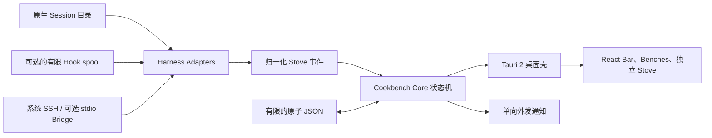

- **Core：** Rust workspace 负责身份、状态转换、Adapter 合同、脱敏、SSH 协议与通知策略。
- **Desktop：** Tauri 2 提供原生窗口、托盘、聚焦集成、秘密存储访问与打包；React
  渲染轻量界面。
- **Storage：** 有限的原子 JSON 只保存设置、固定/归档状态、显示位置和最小验证
  locator，没有 SQLite 数据库。
- **Platforms：** macOS、Windows、图形化 Ubuntu/Linux 是 V1 一等目标。
  GNOME Wayland 提供可选显示扩展，并如实保留 best-effort 限制。

## 写给 Agent

Cookbench 被刻意设计成一个可以安全待在 Agent 身边的工具。如果你是正在阅读这个
仓库的 Agent，请把下面这些内容视为产品合同，而不只是贡献者礼仪。

### 合同

- **事实：** Harness 的原生 Session 文件具有权威性。Cookbench 状态只包含展示
  元数据、偏好、固定、归档与最小的已验证返回 locator。
- **隐私：** 不得把原始提示词、对话、代码、命令、工具 I/O、token、凭证、私钥、
  webhook 地址或真实用户 Session fixture 放进诊断、测试、Issue、Commit 或 PR。
- **自主性：** 不得增加向 Agent 发送提示、批准、启动、停止、托管、替代或其他
  control 行为。
- **返回：** 只有 Session 到窗口身份链通过验证后才能宣称精准返回，否则必须提供
  明确的项目、应用、终端或 resume fallback。
- **Hooks：** Cookbench 自有 Hook 可以向 spool 输出有限生命周期元数据，但必须
  保留 Harness 的其他配置，并能干净卸载。
- **Remote：** SSH 观察只读；可选 Bridge 使用带版本的 SSH stdio，不开放端口，
  不接受远程 control 命令。
- **Notifications：** 通知只向外发送；不要增加入站 webhook、聊天轮询或命令处理。
- **State UI：** 只有可靠的结构化 Cooking 进度可以使用不完整圆弧；Needs Human、
  Cooked、Failed、Disconnected 永远使用完整圆环。

### 增加一个 Harness Adapter

Adapter 增加的是归一化观察合同，而不是 Agent 对话的私人副本：

1. 在 catalog 注册稳定 Profile 与能力分级。
2. 只发现有文档支持的原生目录，或用户明确填写的绝对路径。
3. 只解析所需的最小身份与生命周期字段。
4. 如实报告置信度和降级行为。
5. 只有完成关联与验证后才能输出精准 locator。
6. 增加合成的、仅含元数据的 fixture、脱敏测试、状态测试和已知缺口文档。
7. 可选 Hook 安装必须由 Cookbench 自己拥有、可逆，并与 Harness 的其他配置隔离。

从 [AGENTS.md](AGENTS.md)、[兼容性矩阵](docs/harness-compatibility.md)、
[Hook 规则](docs/integrations/hooks.md)、[安全边界](docs/security.md)与
[隐私边界](docs/privacy.md)开始。使用 `./scripts/verify.sh` 验证完整合同。本仓库的
Commit 遵循 `AGENTS.md` 定义的 Lore Commit Protocol。

## 开源意味着你真的可以动手改

Cookbench 从头到尾使用 MIT 许可证。你可以原样使用、审查每条信任边界、增加私有
Harness Adapter、调整视觉外壳、翻译新语言，或 DIY 一个完全留在自己机器上的工作流。
系统被有意保持在可以理解的体量，不需要挖掘某个托管 control plane 才能搞懂。

```bash
corepack enable
pnpm install
pnpm lint
pnpm test --run
pnpm build
cargo fmt --all -- --check
cargo clippy --workspace --all-targets -- -D warnings
cargo test --workspace
```

完整本地发布门禁是 `./scripts/verify.sh`。发布制品前请阅读[发布文档](docs/releasing.md)。

## 13 张图看完 Cookbench

下面的完整中文视觉介绍面向 AI 小白、日常 Agent 用户，以及已经并行运行到需要一张
真正工作台的重度用户。所有页面都由可编辑 HTML 离线生成，只使用 Cookbench 自有
标志、系统字体和 CSS。源文件与确定性渲染器位于
[docs/showcase](docs/showcase/README.md)。

<details>
<summary><strong>展开完整 13 张产品介绍图</strong></summary>

<table>
  <tr><td></td><td>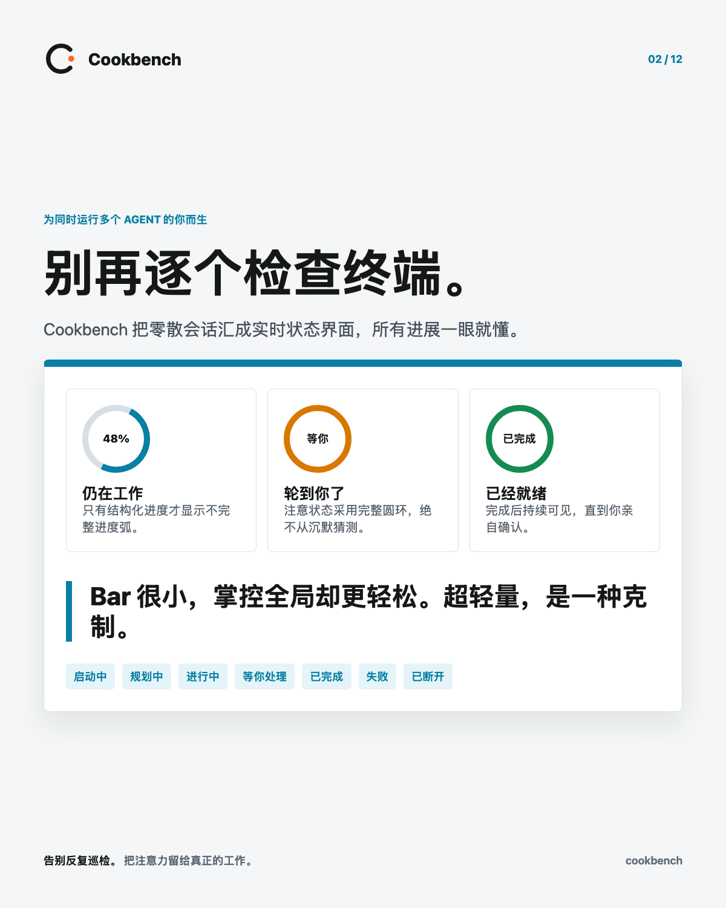</td></tr>
  <tr><td>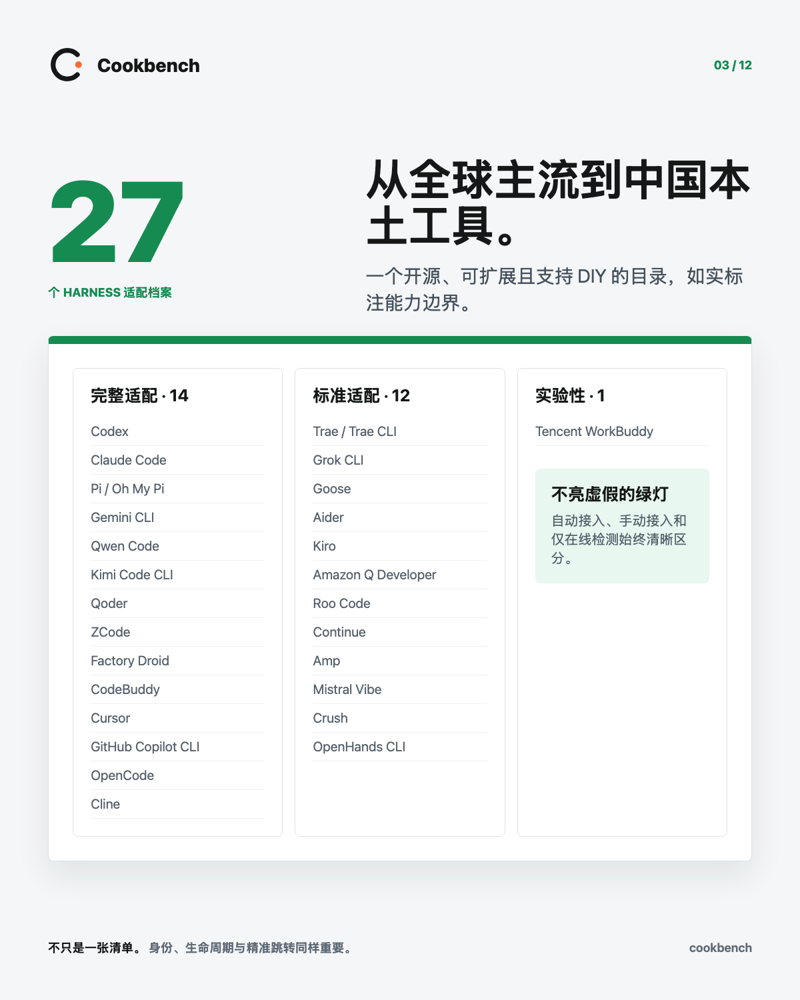</td><td>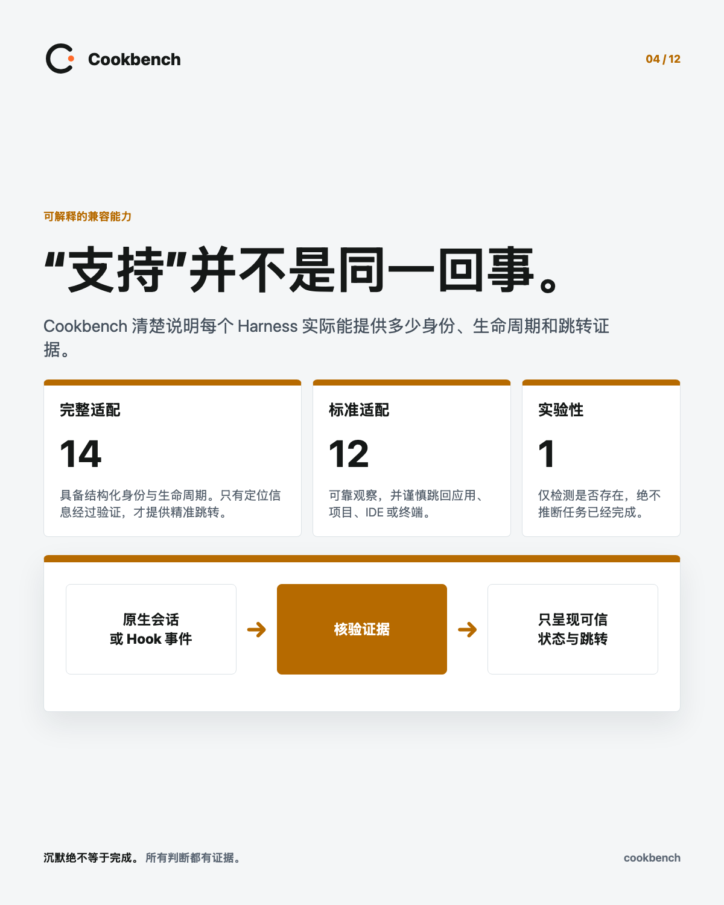</td></tr>
  <tr><td>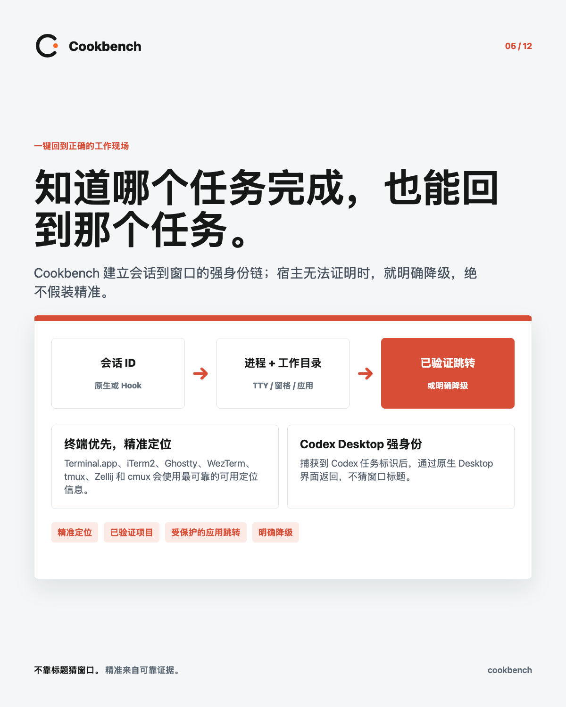</td><td>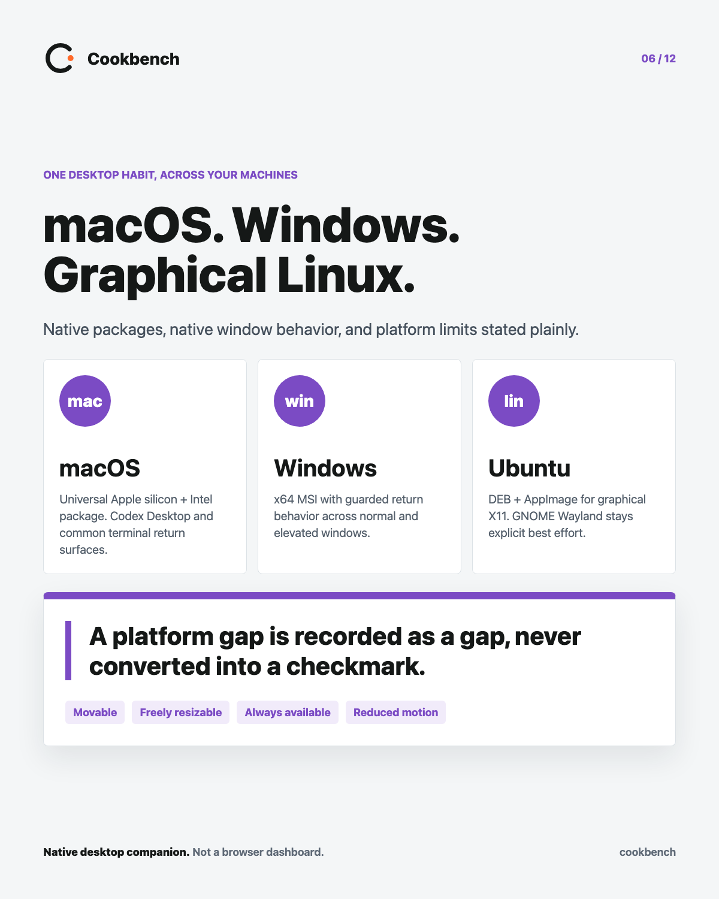</td></tr>
  <tr><td>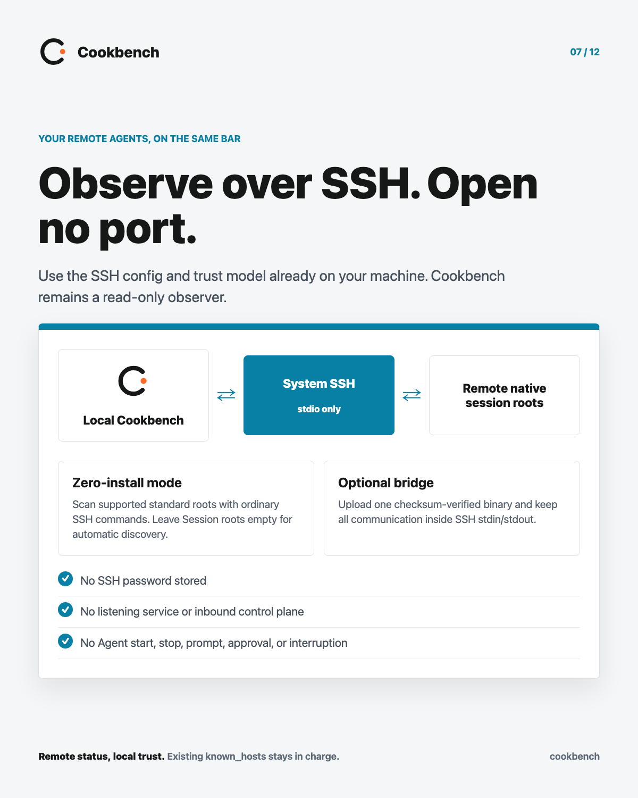</td><td>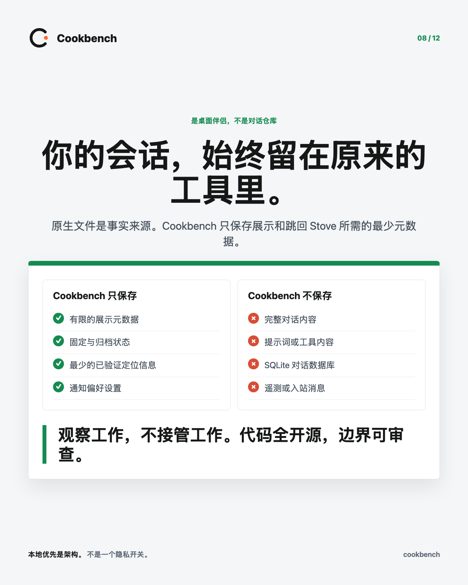</td></tr>
  <tr><td>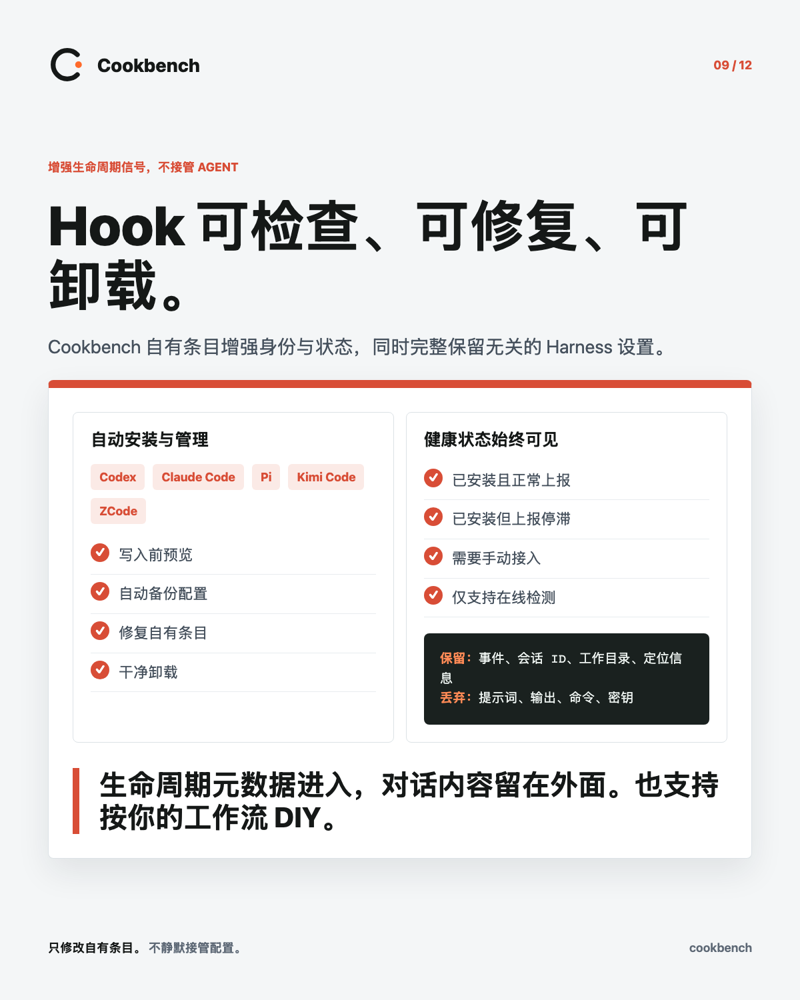</td><td>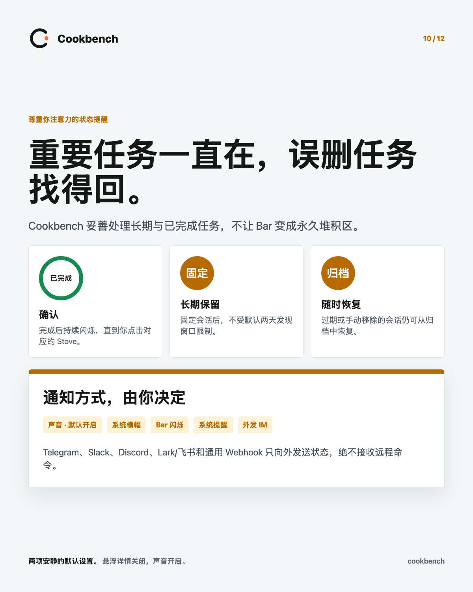</td></tr>
  <tr><td>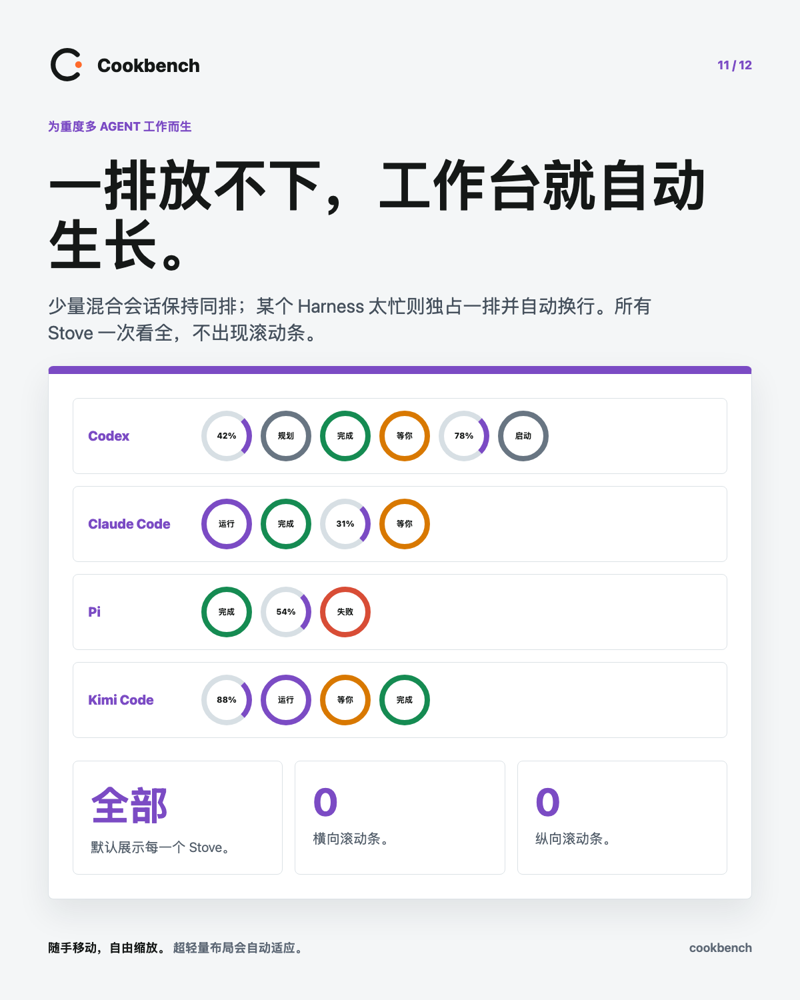</td><td>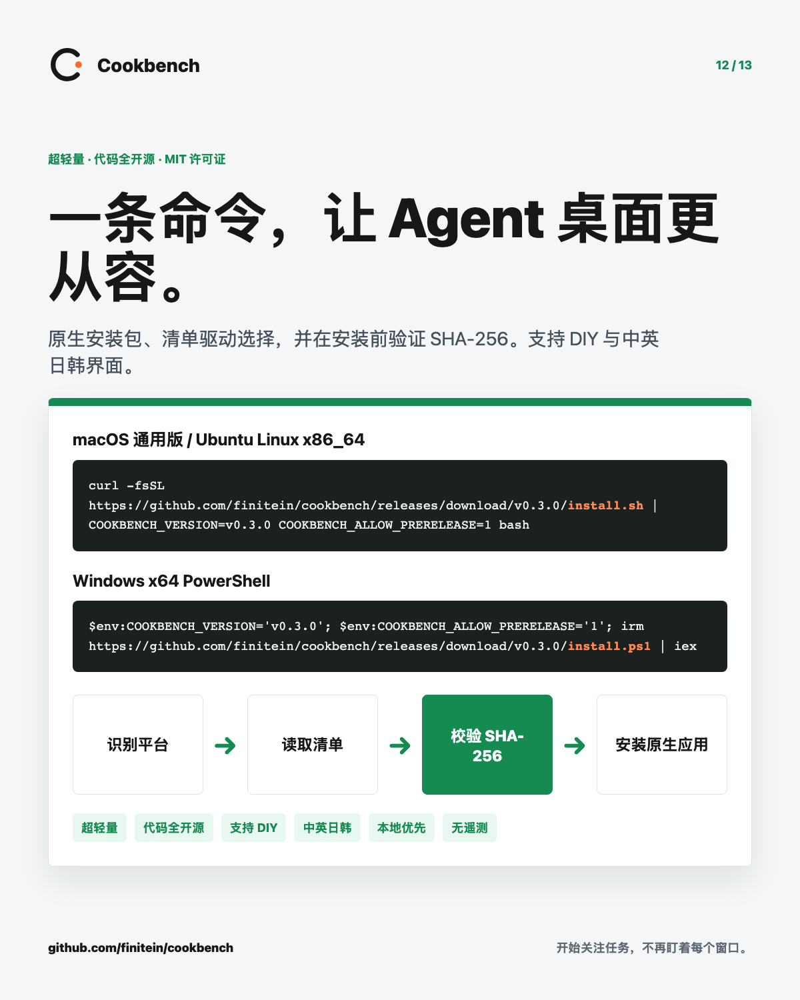</td></tr>
  <tr><td></td><td></td></tr>
</table>

</details>

## 证据，而不是氛围

Cookbench 仍是开源预览版。自动化 CI 覆盖 Rust 与 TypeScript 测试、状态机、Adapter
合同、脱敏、打包规则、GNOME 协议、生产构建隔离与 Chromium 交互流程。当前有记录的
原生证据覆盖 macOS 和 Ubuntu X11。

Windows 图形化启动、GNOME Wayland、所有终端实现的精准聚焦、多显示器恢复、真实远程
SSH、原生通知中心与供应商 sandbox 仍是明确的人工发布门禁。浏览器测试变绿不会被
伪装成原生平台通过。

继续查看 [17 条验收核对表](docs/verification/release-checklist.md)、
[性能基线](docs/verification/performance-macos.md)与[发布流程](docs/releasing.md)。

## 许可证

Cookbench 使用 [MIT License](LICENSE) 发布。第三方归属记录在
[THIRD_PARTY_NOTICES.md](THIRD_PARTY_NOTICES.md)。
